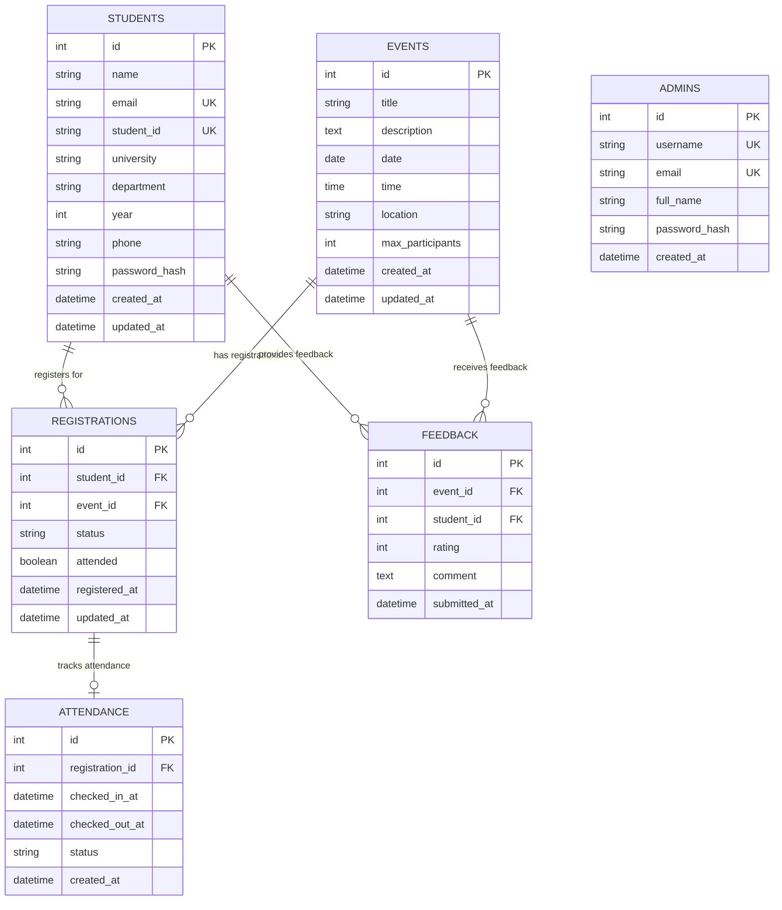
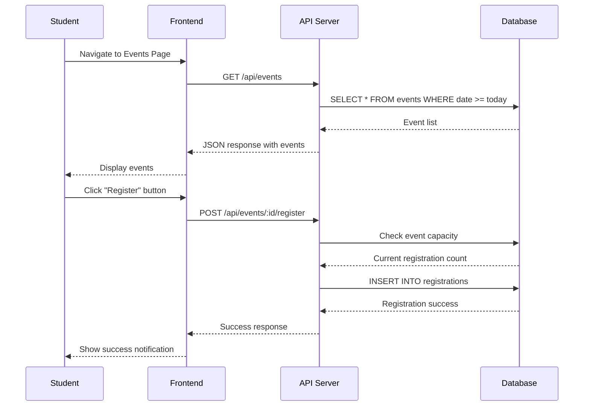
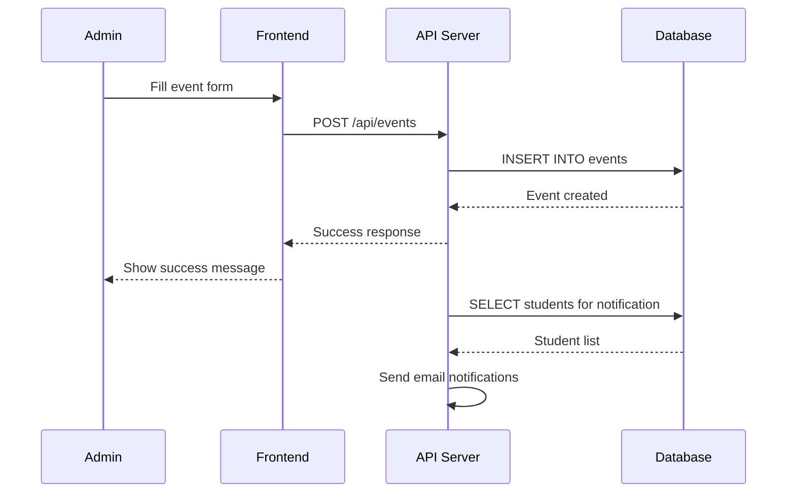
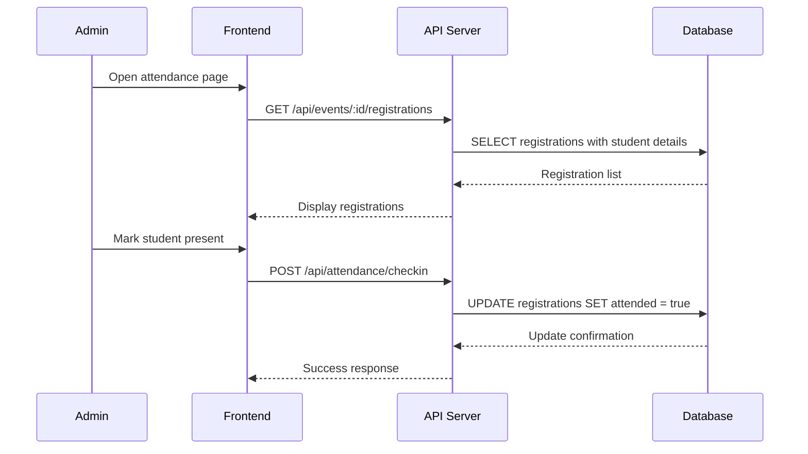

# Campus Event Management System - Design Documentation

## Table of Contents
1. [Project Overview](#project-overview)
2. [System Architecture](#system-architecture)
3. [Data to Track](#data-to-track)
4. [Database Schema](#database-schema)
5. [API Design](#api-design)
6. [Workflows & Sequence Diagrams](#workflows--sequence-diagrams)
7. [User Interface Design](#user-interface-design)
8. [Assumptions & Edge Cases](#assumptions--edge-cases)
9. [Security Considerations](#security-considerations)
10. [Performance Optimizations](#performance-optimizations)
11. [Future Enhancements](#future-enhancements)

---

## 1. Project Overview

The **Campus Event Management System** is a comprehensive web application designed to streamline event organization, student registration, attendance tracking, and report generation for educational institutions. The system provides a modern, intuitive interface with two distinct portals:

- **Student Portal**: Event discovery, registration, profile management
- **Admin Portal**: Event management, student administration, analytics & reporting

### Key Features
- Event creation and management
- Student registration and authentication
- Real-time event capacity tracking
- Attendance monitoring
- Feedback collection system
- Comprehensive reporting and analytics
- Beautiful, responsive UI with light color themes

---

## 2. System Architecture

### Technology Stack
```
Frontend:
├── React 18 (Component Framework)
├── Vite (Build Tool)
├── TailwindCSS (Styling)
├── Lucide Icons (Icon Library)
└── Custom UI Components

Backend:
├── Node.js (Runtime)
├── Express.js (Web Framework)
├── SQLite3 (Database)
├── JWT (Authentication)
└── bcrypt (Password Hashing)
```

### Architecture Diagram
```
┌─────────────────┐    ┌─────────────────┐
│  Student Portal │    │  Admin Portal   │
│   (React/Vite)  │    │   (React/Vite)  │
├─────────────────┤    ├─────────────────┤
│ • Events Page   │    │ • Dashboard     │
│ • Profile Page  │    │ • Event Mgmt    │
│ • Registration  │    │ • Student Mgmt  │
│ • Auth Page     │    │ • Reports       │
└─────────────────┘    └─────────────────┘
         │                       │
         └───────────┬───────────┘
                     │
            ┌─────────────────┐
            │   API Gateway   │
            │   (Express.js)  │
            └─────────────────┘
                     │
            ┌─────────────────┐
            │   SQLite DB     │
            │   (File-based)  │
            └─────────────────┘
```

---

## 3. Data to Track

### Core Data Entities

#### Event Management
- **Event Details**: Title, description, date, time, location
- **Event Capacity**: Maximum participants, current registrations
- **Event Status**: Active, cancelled, completed
- **Event Categories**: Academic, cultural, sports, technical

#### Student Registration
- **Registration Records**: Student-event mapping, timestamps
- **Registration Status**: Active, cancelled, attended
- **Registration Limits**: Per-event capacity constraints
- **Waitlist Management**: Queue for full events

#### Attendance Tracking
- **Check-in Records**: Entry timestamps, verification
- **Check-out Records**: Exit timestamps, duration
- **Attendance Status**: Present, absent, partial
- **Attendance Analytics**: Participation rates, trends

#### Feedback Collection
- **Event Ratings**: 1-5 star rating system
- **Written Feedback**: Comments and suggestions
- **Feedback Analytics**: Average ratings, sentiment analysis
- **Response Rates**: Participation in feedback

#### User Management
- **Student Profiles**: Personal info, academic details
- **Admin Accounts**: Credentials, permissions, roles
- **Authentication**: Login sessions, password management
- **Activity Logs**: User actions, system events

---

## 4. Database Schema

### Entity Relationship Diagram



### Table Specifications

#### STUDENTS Table
```sql
CREATE TABLE students (
    id INTEGER PRIMARY KEY AUTOINCREMENT,
    name VARCHAR(100) NOT NULL,
    email VARCHAR(100) UNIQUE NOT NULL,
    student_id VARCHAR(50) UNIQUE NOT NULL,
    university VARCHAR(100) NOT NULL,
    department VARCHAR(100) NOT NULL,
    year INTEGER NOT NULL CHECK (year BETWEEN 1 AND 4),
    phone VARCHAR(20),
    password_hash VARCHAR(255) NOT NULL,
    created_at DATETIME DEFAULT CURRENT_TIMESTAMP,
    updated_at DATETIME DEFAULT CURRENT_TIMESTAMP
);

-- Indexes for performance
CREATE INDEX idx_students_email ON students(email);
CREATE INDEX idx_students_student_id ON students(student_id);
CREATE INDEX idx_students_department ON students(department);
```

#### EVENTS Table
```sql
CREATE TABLE events (
    id INTEGER PRIMARY KEY AUTOINCREMENT,
    title VARCHAR(200) NOT NULL,
    description TEXT,
    date DATE NOT NULL,
    time TIME NOT NULL,
    location VARCHAR(200) NOT NULL,
    max_participants INTEGER NOT NULL CHECK (max_participants > 0),
    created_at DATETIME DEFAULT CURRENT_TIMESTAMP,
    updated_at DATETIME DEFAULT CURRENT_TIMESTAMP
);

-- Indexes for performance
CREATE INDEX idx_events_date ON events(date);
CREATE INDEX idx_events_created_at ON events(created_at);
```

#### REGISTRATIONS Table
```sql
CREATE TABLE registrations (
    id INTEGER PRIMARY KEY AUTOINCREMENT,
    student_id INTEGER NOT NULL,
    event_id INTEGER NOT NULL,
    status VARCHAR(20) DEFAULT 'active' CHECK (status IN ('active', 'cancelled', 'attended')),
    attended BOOLEAN DEFAULT FALSE,
    registered_at DATETIME DEFAULT CURRENT_TIMESTAMP,
    updated_at DATETIME DEFAULT CURRENT_TIMESTAMP,
    FOREIGN KEY (student_id) REFERENCES students(id) ON DELETE CASCADE,
    FOREIGN KEY (event_id) REFERENCES events(id) ON DELETE CASCADE,
    UNIQUE(student_id, event_id)
);

-- Indexes for performance
CREATE INDEX idx_registrations_student_id ON registrations(student_id);
CREATE INDEX idx_registrations_event_id ON registrations(event_id);
CREATE INDEX idx_registrations_status ON registrations(status);
```

---

## 5. API Design

### Authentication Endpoints
```
POST /api/auth/student/signup     - Student registration
POST /api/auth/student/login      - Student authentication
POST /api/auth/admin/signup       - Admin registration
POST /api/auth/admin/login        - Admin authentication
POST /api/auth/logout             - User logout
GET  /api/auth/verify             - Token verification
```

### Student Portal Endpoints
```
GET  /api/events                  - Fetch all events
GET  /api/events/:id              - Get specific event details
GET  /api/events/my-registrations - Get student's registrations
POST /api/events/:id/register     - Register for event
DELETE /api/events/:id/unregister - Unregister from event
GET  /api/students/profile        - Get student profile
PUT  /api/students/profile        - Update student profile
```

### Admin Portal Endpoints
```
GET    /api/events                - Fetch all events (admin view)
POST   /api/events                - Create new event
PUT    /api/events/:id            - Update event
DELETE /api/events/:id            - Delete event
GET    /api/events/:id/registrations - Get event registrations
GET    /api/students              - Fetch all students
POST   /api/students              - Add new student
PUT    /api/students/:id          - Update student
DELETE /api/students/:id          - Delete student
```

### Feedback & Analytics Endpoints
```
POST /api/feedback/events/:id     - Submit event feedback
GET  /api/feedback/events/:id     - Get event feedback
GET  /api/reports/events          - Generate event reports
GET  /api/reports/students        - Generate student reports
GET  /api/reports/attendance      - Generate attendance reports
GET  /api/analytics/dashboard     - Get dashboard analytics
```

### API Response Format
```json
{
  "success": true,
  "data": {
    "events": [...],
    "total": 10,
    "page": 1
  },
  "message": "Events fetched successfully",
  "timestamp": "2025-09-07T10:30:00Z"
}
```

### Error Response Format
```json
{
  "success": false,
  "error": {
    "code": "VALIDATION_ERROR",
    "message": "Invalid input data",
    "details": {
      "email": "Email is required",
      "password": "Password must be at least 8 characters"
    }
  },
  "timestamp": "2025-09-07T10:30:00Z"
}
```

---

## 6. Workflows & Sequence Diagrams

### Student Registration Workflow


### Event Creation Workflow


### Attendance Tracking Workflow


---

## 7. User Interface Design

### Design System & Color Themes

The application features a modern, elegant design with light background colors to create a welcoming user experience.

#### Student Portal Color Scheme
- **Primary**: Blue to Indigo gradients
- **Secondary**: Emerald, Teal, Cyan
- **Accent**: Rose, Pink, Purple
- **Neutral**: Light grays with subtle tints

#### Admin Portal Color Scheme
- **Primary**: Orange to Amber gradients
- **Secondary**: Teal, Cyan
- **Accent**: Rose, Pink, Violet
- **Neutral**: Light grays with warm tints

### Component Design Patterns

#### Card Components
```jsx
// Example of gradient card design
<Card className="bg-gradient-to-br from-white to-blue-50 border border-blue-200 shadow-lg">
  <CardHeader className="border-b border-blue-100">
    <CardTitle className="text-gray-800">Event Title</CardTitle>
  </CardHeader>
  <CardContent>
    {/* Card content */}
  </CardContent>
</Card>
```

#### Button Variations
```jsx
// Primary gradient button
<Button className="bg-gradient-to-r from-blue-600 to-indigo-600 hover:from-blue-700 hover:to-indigo-700 text-white shadow-lg">
  Register Now
</Button>

// Outline button
<Button variant="outline" className="border-emerald-300 text-emerald-700 hover:bg-emerald-50">
  View Details
</Button>
```

#### Stats Cards
```jsx
<div className="bg-gradient-to-br from-emerald-100 to-emerald-200 rounded-lg border border-emerald-300 p-6 text-center shadow-sm">
  <Users className="h-8 w-8 text-emerald-700 mx-auto mb-2" />
  <h3 className="text-sm font-medium text-emerald-800 uppercase tracking-wide">
    Your Registrations
  </h3>
  <p className="text-2xl font-bold text-emerald-900">{count}</p>
</div>
```

### Responsive Design Guidelines
- Mobile-first approach
- Flexible grid layouts
- Touch-friendly interface elements
- Optimized typography scaling
- Adaptive component spacing

---

## 8. Assumptions & Edge Cases

### System Assumptions

1. **Single Institution**: Designed for one university/college
2. **Academic Calendar**: Events follow academic year patterns
3. **Email Uniqueness**: Each student has unique institutional email
4. **Modern Browsers**: ES6+ JavaScript support required
5. **Stable Connectivity**: Real-time features require consistent internet

### Edge Cases & Solutions

#### Registration Edge Cases
```javascript
// Prevent duplicate registrations
const checkDuplicateRegistration = async (studentId, eventId) => {
  const existing = await Registration.findOne({
    where: { student_id: studentId, event_id: eventId }
  });
  
  if (existing) {
    throw new Error('Already registered for this event');
  }
};

// Handle event capacity limits
const checkEventCapacity = async (eventId) => {
  const event = await Event.findByPk(eventId);
  const currentCount = await Registration.count({
    where: { event_id: eventId, status: 'active' }
  });
  
  if (currentCount >= event.max_participants) {
    throw new Error('Event is at capacity');
  }
};

// Prevent registration for past events
const validateEventDate = (eventDate) => {
  if (new Date(eventDate) < new Date()) {
    throw new Error('Cannot register for past events');
  }
};
```

#### Data Integrity Edge Cases
```javascript
// Handle missing feedback gracefully
const getFeedbackSummary = async (eventId) => {
  const feedback = await Feedback.findAll({
    where: { event_id: eventId }
  });
  
  if (feedback.length === 0) {
    return {
      averageRating: null,
      totalResponses: 0,
      message: 'No feedback available yet'
    };
  }
  
  const averageRating = feedback.reduce((sum, f) => sum + f.rating, 0) / feedback.length;
  return {
    averageRating: Math.round(averageRating * 10) / 10,
    totalResponses: feedback.length
  };
};

// Concurrent registration handling
const handleConcurrentRegistration = async (studentId, eventId) => {
  return await sequelize.transaction(async (transaction) => {
    const event = await Event.findByPk(eventId, {
      lock: true,
      transaction
    });
    
    const currentCount = await Registration.count({
      where: { event_id: eventId, status: 'active' },
      transaction
    });
    
    if (currentCount >= event.max_participants) {
      throw new Error('Event is now full');
    }
    
    return await Registration.create({
      student_id: studentId,
      event_id: eventId,
      status: 'active'
    }, { transaction });
  });
};
```

#### Event Management Edge Cases
```javascript
// Handle event cancellation
const cancelEvent = async (eventId, reason) => {
  await sequelize.transaction(async (transaction) => {
    // Update event status
    await Event.update(
      { status: 'cancelled' },
      { where: { id: eventId }, transaction }
    );
    
    // Cancel all registrations
    await Registration.update(
      { status: 'cancelled' },
      { where: { event_id: eventId }, transaction }
    );
    
    // Send notifications to registered students
    const registrations = await Registration.findAll({
      where: { event_id: eventId },
      include: [{ model: Student, attributes: ['email', 'name'] }],
      transaction
    });
    
    // Queue email notifications
    registrations.forEach(reg => {
      emailService.queueCancellationEmail(
        reg.Student.email,
        reg.Student.name,
        reason
      );
    });
  });
};
```

---

## 9. Security Considerations

### Authentication & Authorization
```javascript
// JWT token implementation
const generateToken = (user) => {
  return jwt.sign(
    { 
      id: user.id, 
      email: user.email, 
      role: user.role 
    },
    process.env.JWT_SECRET,
    { 
      expiresIn: '24h',
      issuer: 'campus-events',
      audience: 'campus-users'
    }
  );
};

// Route protection middleware
const requireAuth = async (req, res, next) => {
  try {
    const token = req.headers.authorization?.split(' ')[1];
    if (!token) {
      return res.status(401).json({ error: 'No token provided' });
    }
    
    const decoded = jwt.verify(token, process.env.JWT_SECRET);
    req.user = decoded;
    next();
  } catch (error) {
    return res.status(401).json({ error: 'Invalid token' });
  }
};

// Role-based access control
const requireAdmin = (req, res, next) => {
  if (req.user.role !== 'admin') {
    return res.status(403).json({ error: 'Admin access required' });
  }
  next();
};
```

### Data Protection
```javascript
// Password hashing
const hashPassword = async (password) => {
  const saltRounds = 12;
  return await bcrypt.hash(password, saltRounds);
};

// Input validation
const validateEventInput = (eventData) => {
  const schema = Joi.object({
    title: Joi.string().min(3).max(200).required(),
    description: Joi.string().max(1000),
    date: Joi.date().min('now').required(),
    time: Joi.string().pattern(/^([0-1]?[0-9]|2[0-3]):[0-5][0-9]$/).required(),
    location: Joi.string().min(3).max(200).required(),
    max_participants: Joi.number().integer().min(1).max(10000).required()
  });
  
  return schema.validate(eventData);
};

// SQL injection prevention
const safeQuery = async (query, params) => {
  return await db.query(query, {
    replacements: params,
    type: QueryTypes.SELECT
  });
};
```

### Additional Security Measures
- HTTPS enforcement in production
- CORS configuration for cross-origin requests
- Rate limiting for API endpoints
- Input sanitization for XSS prevention
- Audit logging for admin actions
- Session management and logout handling

---

## 10. Performance Optimizations

### Database Optimizations
```sql
-- Optimized queries with indexes
CREATE INDEX idx_events_date_status ON events(date, status);
CREATE INDEX idx_registrations_event_student ON registrations(event_id, student_id);
CREATE INDEX idx_feedback_event_rating ON feedback(event_id, rating);

-- Query optimization example
SELECT 
  e.*,
  COUNT(r.id) as registration_count,
  AVG(f.rating) as average_rating
FROM events e
LEFT JOIN registrations r ON e.id = r.event_id AND r.status = 'active'
LEFT JOIN feedback f ON e.id = f.event_id
WHERE e.date >= CURRENT_DATE
GROUP BY e.id
ORDER BY e.date ASC
LIMIT 10;
```

### Frontend Optimizations
```javascript
// Component lazy loading
const Events = lazy(() => import('./pages/Events'));
const Dashboard = lazy(() => import('./pages/Dashboard'));

// Memoization for expensive calculations
const eventStats = useMemo(() => {
  return events.reduce((stats, event) => {
    stats.total++;
    if (new Date(event.date) > new Date()) {
      stats.upcoming++;
    }
    return stats;
  }, { total: 0, upcoming: 0 });
}, [events]);

// Debounced search
const debouncedSearch = useCallback(
  debounce((searchTerm) => {
    setFilteredEvents(
      events.filter(event => 
        event.title.toLowerCase().includes(searchTerm.toLowerCase())
      )
    );
  }, 300),
  [events]
);
```

### Caching Strategies
```javascript
// Redis caching for frequently accessed data
const getCachedEvents = async () => {
  const cacheKey = 'events:active';
  const cached = await redis.get(cacheKey);
  
  if (cached) {
    return JSON.parse(cached);
  }
  
  const events = await Event.findAll({
    where: { status: 'active' },
    order: [['date', 'ASC']]
  });
  
  await redis.setex(cacheKey, 300, JSON.stringify(events)); // 5 minutes
  return events;
};

// Browser caching for static assets
app.use('/static', express.static('public', {
  maxAge: '1y',
  etag: true
}));
```

---

## 11. Future Enhancements

### Phase 2 Features

#### Mobile Application
- React Native development
- Push notifications
- Offline event browsing
- QR code check-in system

#### Advanced Analytics
```javascript
// Enhanced analytics dashboard
const advancedAnalytics = {
  eventTrends: {
    popularCategories: ['technical', 'cultural', 'sports'],
    attendanceRates: { avg: 85, trend: '+5%' },
    feedbackScores: { avg: 4.2, improvement: '+0.3' }
  },
  studentEngagement: {
    activeUsers: 1250,
    averageEventsPerStudent: 3.2,
    retentionRate: 78
  },
  predictiveInsights: {
    expectedAttendance: 180,
    recommendedCapacity: 200,
    optimalTiming: '2:00 PM - 4:00 PM'
  }
};
```

#### Integration Capabilities
- LMS (Learning Management System) integration
- University calendar synchronization
- Email marketing platform connection
- Social media sharing features
- Payment gateway for paid events

#### Advanced Features
```javascript
// Waitlist management
const waitlistFeatures = {
  automaticPromotion: true,
  notificationSystem: 'email + sms',
  priorityLevels: ['senior', 'department', 'general'],
  maxWaitlistSize: 50
};

// Event templates
const eventTemplates = {
  academicSeminar: {
    defaultDuration: '2 hours',
    suggestedCapacity: 100,
    requiredFields: ['speaker', 'topic', 'prerequisites']
  },
  culturalEvent: {
    defaultDuration: '3 hours',
    suggestedCapacity: 500,
    requiredFields: ['performer', 'genre', 'ageRating']
  }
};

// Multi-language support
const i18nConfig = {
  supportedLanguages: ['en', 'es', 'fr', 'hi'],
  defaultLanguage: 'en',
  rtlSupport: false,
  dateFormats: {
    en: 'MM/DD/YYYY',
    es: 'DD/MM/YYYY'
  }
};
```

### Technical Improvements

#### Microservices Architecture
```
┌─────────────────┐  ┌─────────────────┐  ┌─────────────────┐
│   User Service  │  │  Event Service  │  │Analytics Service│
│                 │  │                 │  │                 │
│ • Authentication│  │ • Event CRUD    │  │ • Data Processing│
│ • User Profiles │  │ • Registration  │  │ • Report Gen    │
│ • Permissions   │  │ • Capacity Mgmt │  │ • Insights      │
└─────────────────┘  └─────────────────┘  └─────────────────┘
         │                     │                     │
         └─────────────────────┼─────────────────────┘
                               │
                    ┌─────────────────┐
                    │  API Gateway    │
                    │                 │
                    │ • Rate Limiting │
                    │ • Load Balancing│
                    │ • Authentication│
                    └─────────────────┘
```

#### Real-time Features
```javascript
// WebSocket implementation for real-time updates
const socketEvents = {
  'event:registered': (data) => {
    updateEventCapacity(data.eventId);
    notifyAdmins(`New registration for ${data.eventTitle}`);
  },
  'event:capacity_reached': (data) => {
    closeRegistration(data.eventId);
    activateWaitlist(data.eventId);
  },
  'feedback:submitted': (data) => {
    updateEventRating(data.eventId);
    notifyEventCreator(data);
  }
};

// Progressive Web App capabilities
const pwaConfig = {
  serviceWorker: true,
  offlineMode: 'cache-first',
  installPrompt: true,
  backgroundSync: ['registrations', 'feedback'],
  pushNotifications: {
    eventReminders: true,
    capacityAlerts: true,
    feedbackRequests: true
  }
};
```

---

## Conclusion

This design documentation provides a comprehensive foundation for the Campus Event Management System. The system is built with scalability, maintainability, and user experience as core principles. The modern UI design with light color themes creates an engaging and accessible platform for both students and administrators.

The architecture supports future enhancements while maintaining simplicity in the current implementation. Security considerations, performance optimizations, and edge case handling ensure a robust and reliable system suitable for educational institutions of various sizes.

---

**Document Version**: 1.0  
**Last Updated**: September 7, 2025  
**Project Status**: Completed - Ready for Deployment

---

## Appendix

### File Structure
```
campus_Mangement/
├── backend/
│   ├── server.js
│   ├── controllers/
│   ├── routes/
│   └── database/
├── frontend-student/
│   ├── src/
│   │   ├── pages/
│   │   ├── components/
│   │   └── lib/
│   └── package.json
├── frontend-admin/
│   ├── src/
│   │   ├── pages/
│   │   ├── components/
│   │   └── lib/
│   └── package.json
└── DESIGN_DOCUMENTATION.md
```

### Environment Variables
```env
# Database Configuration
DATABASE_PATH=./database/campus_events.db

# JWT Configuration
JWT_SECRET=your-secret-key-here
JWT_EXPIRES_IN=24h

# Email Configuration
SMTP_HOST=smtp.gmail.com
SMTP_PORT=587
SMTP_USER=your-email@domain.com
SMTP_PASS=your-app-password

# Server Configuration
PORT=5000
NODE_ENV=development
```

### Dependencies
```json
{
  "frontend": {
    "react": "^18.0.0",
    "vite": "^4.0.0",
    "tailwindcss": "^3.0.0",
    "lucide-react": "^0.200.0"
  },
  "backend": {
    "express": "^4.18.0",
    "sqlite3": "^5.1.0",
    "jsonwebtoken": "^9.0.0",
    "bcryptjs": "^2.4.0"
  }
}
```
