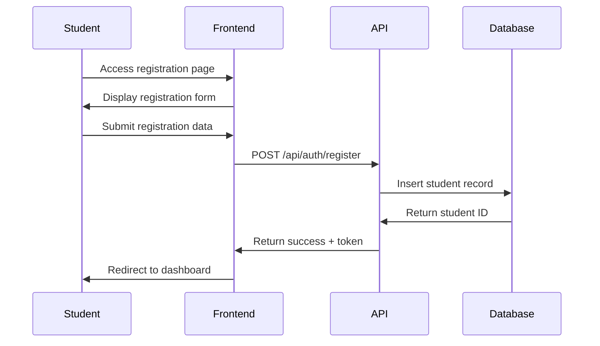
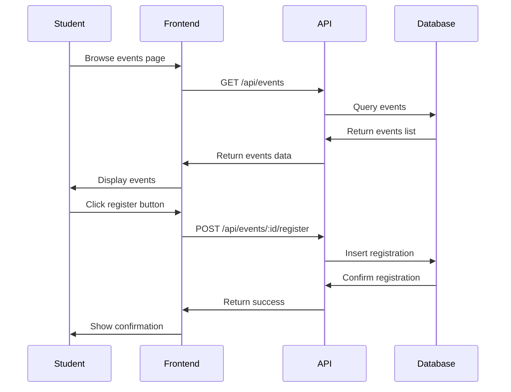
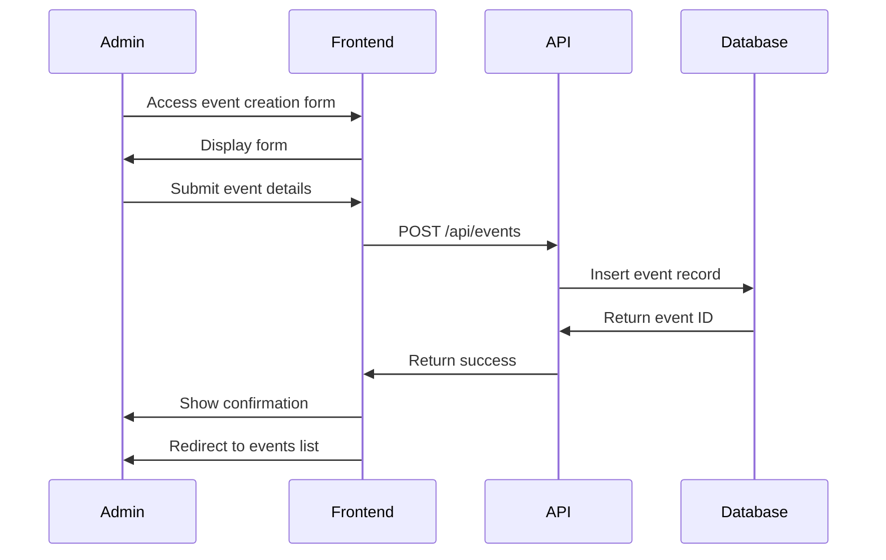

# Campus Event Management Platform - Complete Documentation

## Table of Contents
1. [Project Overview](#project-overview)
2. [Architecture & Tech Stack](#architecture--tech-stack)
3. [Database Schema](#database-schema)
4. [API Documentation](#api-documentation)
5. [Frontend Components](#frontend-components)
6. [User Workflows](#user-workflows)
7. [Design System](#design-system)
8. [Security & Authentication](#security--authentication)
9. [Deployment Guide](#deployment-guide)
10. [Development Setup](#development-setup)
11. [Testing Strategy](#testing-strategy)
12. [Performance Considerations](#performance-considerations)
13. [Future Enhancements](#future-enhancements)

## Project Overview

### Purpose
The Campus Event Management Platform is a comprehensive web application designed to streamline event management for educational institutions. It provides separate portals for students and administrators to manage campus events, registrations, attendance, and feedback.

### Key Features
- **Student Portal**: Event discovery, registration, profile management, attendance tracking
- **Admin Portal**: Event creation, student management, attendance tracking, comprehensive reporting
- **Real-time Updates**: Dynamic event status, registration counts, attendance tracking
- **Responsive Design**: Modern UI with light color schemes optimized for all devices
- **Role-based Access**: Secure authentication with different permission levels

### Target Users
- **Students**: Browse events, register/unregister, track attendance, provide feedback
- **Administrators**: Create/manage events, monitor registrations, track attendance, generate reports
- **Event Coordinators**: Specialized admin role for event-specific management

## Architecture & Tech Stack

### Frontend Architecture
```
Frontend Structure:
├── Student Portal (React + Vite)
│   ├── Authentication (Login/Register)
│   ├── Event Discovery & Registration
│   ├── Profile Management
│   ├── Registration History
│   └── Feedback System
└── Admin Portal (React + Vite)
    ├── Dashboard & Analytics
    ├── Event Management
    ├── Student Management
    ├── Attendance Tracking
    └── Report Generation
```

### Backend Architecture
```
Backend Structure:
├── Node.js + Express Server
├── SQLite Database
├── RESTful API Design
├── JWT Authentication
├── Role-based Authorization
└── CORS Configuration
```

### Technology Stack

#### Frontend
- **Framework**: React 18 with Vite
- **Styling**: Tailwind CSS with custom gradient themes
- **UI Components**: Custom component library with shadcn/ui patterns
- **Icons**: Lucide React for consistent iconography
- **State Management**: React hooks (useState, useEffect)
- **HTTP Client**: Axios for API communication
- **Build Tool**: Vite for fast development and optimized builds

#### Backend
- **Runtime**: Node.js
- **Framework**: Express.js
- **Database**: SQLite with better-sqlite3
- **Authentication**: JWT (JSON Web Tokens)
- **Password Security**: bcrypt for hashing
- **CORS**: cors middleware for cross-origin requests
- **Validation**: Express validator middleware

#### Development Tools
- **Code Quality**: ESLint configuration
- **CSS Processing**: PostCSS with Tailwind
- **Package Management**: npm
- **Version Control**: Git

## Database Schema

### Core Tables

#### Students Table
```sql
CREATE TABLE students (
    id INTEGER PRIMARY KEY AUTOINCREMENT,
    email TEXT UNIQUE NOT NULL,
    password TEXT NOT NULL,
    first_name TEXT NOT NULL,
    last_name TEXT NOT NULL,
    student_id TEXT UNIQUE NOT NULL,
    department TEXT,
    year INTEGER,
    phone TEXT,
    created_at DATETIME DEFAULT CURRENT_TIMESTAMP
);
```

#### Events Table
```sql
CREATE TABLE events (
    id INTEGER PRIMARY KEY AUTOINCREMENT,
    title TEXT NOT NULL,
    description TEXT,
    date DATE NOT NULL,
    time TIME NOT NULL,
    location TEXT NOT NULL,
    max_participants INTEGER,
    created_by INTEGER,
    created_at DATETIME DEFAULT CURRENT_TIMESTAMP,
    FOREIGN KEY (created_by) REFERENCES students(id)
);
```

#### Event Registrations Table
```sql
CREATE TABLE event_registrations (
    id INTEGER PRIMARY KEY AUTOINCREMENT,
    event_id INTEGER NOT NULL,
    student_id INTEGER NOT NULL,
    registration_date DATETIME DEFAULT CURRENT_TIMESTAMP,
    attendance_status TEXT DEFAULT 'registered',
    feedback TEXT,
    rating INTEGER,
    FOREIGN KEY (event_id) REFERENCES events(id),
    FOREIGN KEY (student_id) REFERENCES students(id),
    UNIQUE(event_id, student_id)
);
```

#### Feedback Table
```sql
CREATE TABLE feedback (
    id INTEGER PRIMARY KEY AUTOINCREMENT,
    event_id INTEGER NOT NULL,
    student_id INTEGER NOT NULL,
    rating INTEGER CHECK (rating >= 1 AND rating <= 5),
    comment TEXT,
    submitted_at DATETIME DEFAULT CURRENT_TIMESTAMP,
    FOREIGN KEY (event_id) REFERENCES events(id),
    FOREIGN KEY (student_id) REFERENCES students(id)
);
```

### Entity Relationship Diagram
```
Students ||--o{ Event_Registrations : registers
Events ||--o{ Event_Registrations : has
Students ||--o{ Feedback : provides
Events ||--o{ Feedback : receives
Students ||--o{ Events : creates (admin role)
```

## API Documentation

### Authentication Endpoints

#### POST /api/auth/login
**Purpose**: Authenticate user and return JWT token
```json
Request Body:
{
  "email": "student@example.com",
  "password": "password123"
}

Response:
{
  "token": "jwt_token_here",
  "user": {
    "id": 1,
    "email": "student@example.com",
    "first_name": "John",
    "last_name": "Doe",
    "role": "student"
  }
}
```

#### POST /api/auth/register
**Purpose**: Create new student account
```json
Request Body:
{
  "email": "newstudent@example.com",
  "password": "password123",
  "first_name": "Jane",
  "last_name": "Smith",
  "student_id": "CS2023001",
  "department": "Computer Science",
  "year": 2
}
```

### Event Management Endpoints

#### GET /api/events
**Purpose**: Retrieve all events
```json
Response:
[
  {
    "id": 1,
    "title": "Tech Workshop",
    "description": "Learn modern web development",
    "date": "2024-03-15",
    "time": "14:00",
    "location": "Lab 101",
    "max_participants": 30,
    "current_registrations": 15
  }
]
```

#### POST /api/events
**Purpose**: Create new event (Admin only)
```json
Request Body:
{
  "title": "Annual Sports Day",
  "description": "Inter-department sports competition",
  "date": "2024-04-20",
  "time": "09:00",
  "location": "Sports Complex",
  "max_participants": 200
}
```

#### POST /api/events/:id/register
**Purpose**: Register student for event
```json
Response:
{
  "message": "Successfully registered for event",
  "registration_id": 123
}
```

#### DELETE /api/events/:id/unregister
**Purpose**: Unregister student from event

### Student Management Endpoints

#### GET /api/students
**Purpose**: Get all students (Admin only)

#### GET /api/students/profile
**Purpose**: Get current student's profile

#### PUT /api/students/profile
**Purpose**: Update student profile

### Reporting Endpoints

#### GET /api/reports/events
**Purpose**: Event statistics and analytics
```json
Response:
{
  "total_events": 25,
  "upcoming_events": 8,
  "total_registrations": 450,
  "events_by_month": [...],
  "popular_events": [...]
}
```

#### GET /api/reports/attendance/:eventId
**Purpose**: Attendance report for specific event

## Frontend Components

### Student Portal Components

#### Layout Component
```jsx
// Provides consistent navigation and styling
- Navigation header with user menu
- Sidebar navigation for mobile
- Light gradient background theme
- Responsive design breakpoints
```

#### Events Page
```jsx
// Features:
- Event discovery with filtering
- Registration/unregistration functionality
- Real-time status updates
- Category-based event icons
- Responsive card layout with light themes
```

#### Profile Page
```jsx
// Features:
- Personal information display/editing
- Registration history
- Attendance tracking
- Department and year information
```

#### Home/Dashboard
```jsx
// Features:
- Quick stats overview
- Upcoming events preview
- Recent activity feed
- Quick action buttons
```

### Admin Portal Components

#### Dashboard
```jsx
// Features:
- Comprehensive analytics
- Event statistics
- Registration trends
- Quick management actions
- Visual charts and graphs
```

#### Event Management
```jsx
// Features:
- Create/edit/delete events
- Manage event details
- View registration lists
- Attendance tracking
- Bulk operations
```

#### Student Management
```jsx
// Features:
- Student directory
- Registration history
- Account management
- Bulk operations
- Export functionality
```

#### Reports
```jsx
// Features:
- Event analytics
- Attendance reports
- Registration statistics
- Feedback summaries
- Export capabilities
```

### UI Component Library

#### Card Components
```jsx
// Standardized card designs with light gradients
- Event cards with hover effects
- Stat cards with icons
- Profile cards
- Action cards
```

#### Form Components
```jsx
// Consistent form styling
- Input fields with light backgrounds
- Buttons with gradient themes
- Select dropdowns
- Textarea components
```

#### Navigation Components
```jsx
// Responsive navigation patterns
- Header navigation
- Sidebar navigation
- Breadcrumb navigation
- Tab navigation
```

## User Workflows

### Student Registration Workflow


### Event Registration Workflow


### Admin Event Creation Workflow


## Design System

### Color Palette
```css
/* Primary Colors */
--blue-50: #eff6ff
--blue-100: #dbeafe
--blue-600: #2563eb
--blue-700: #1d4ed8

/* Secondary Colors */
--indigo-50: #eef2ff
--indigo-100: #e0e7ff
--indigo-600: #7c3aed
--indigo-700: #6d28d9

/* Accent Colors */
--emerald-50: #ecfdf5
--emerald-100: #d1fae5
--emerald-600: #059669
--emerald-700: #047857

/* Neutral Colors */
--gray-50: #f9fafb
--gray-100: #f3f4f6
--gray-600: #4b5563
--gray-700: #374151
```

### Typography Scale
```css
/* Headings */
.text-4xl { font-size: 2.25rem; line-height: 2.5rem; }
.text-3xl { font-size: 1.875rem; line-height: 2.25rem; }
.text-2xl { font-size: 1.5rem; line-height: 2rem; }
.text-xl { font-size: 1.25rem; line-height: 1.75rem; }
.text-lg { font-size: 1.125rem; line-height: 1.75rem; }

/* Body Text */
.text-base { font-size: 1rem; line-height: 1.5rem; }
.text-sm { font-size: 0.875rem; line-height: 1.25rem; }
```

### Spacing System
```css
/* Padding/Margin Scale */
.p-2 { padding: 0.5rem; }
.p-4 { padding: 1rem; }
.p-6 { padding: 1.5rem; }
.p-8 { padding: 2rem; }

/* Grid Gaps */
.gap-2 { gap: 0.5rem; }
.gap-4 { gap: 1rem; }
.gap-6 { gap: 1.5rem; }
```

### Component Patterns

#### Card Pattern
```jsx
<Card className="bg-gradient-to-br from-white to-blue-50 border border-blue-200 hover:shadow-lg transition-all duration-200">
  <CardHeader>
    <CardTitle className="text-lg font-semibold text-gray-800">
      Card Title
    </CardTitle>
  </CardHeader>
  <CardContent>
    Card content here
  </CardContent>
</Card>
```

#### Button Pattern
```jsx
<Button className="bg-gradient-to-r from-blue-600 to-indigo-600 hover:from-blue-700 hover:to-indigo-700 text-white shadow-lg">
  Action Button
</Button>
```

#### Notification Pattern
```jsx
<div className="fixed top-4 right-4 bg-slate-800 text-white px-6 py-4 rounded-lg shadow-2xl z-50">
  <div className="flex items-center">
    <div className="bg-slate-700 rounded-full p-1 mr-3">
      <Icon className="w-5 h-5" />
    </div>
    <div>
      <p className="font-semibold">Notification Title</p>
      <p className="text-sm text-slate-300">Notification message</p>
    </div>
  </div>
</div>
```

## Security & Authentication

### JWT Implementation
```javascript
// Token generation
const token = jwt.sign(
  { 
    id: user.id, 
    email: user.email, 
    role: user.role 
  },
  process.env.JWT_SECRET,
  { expiresIn: '24h' }
);

// Token verification middleware
const verifyToken = (req, res, next) => {
  const token = req.headers.authorization?.split(' ')[1];
  if (!token) {
    return res.status(401).json({ error: 'Access denied' });
  }
  
  try {
    const decoded = jwt.verify(token, process.env.JWT_SECRET);
    req.user = decoded;
    next();
  } catch (error) {
    res.status(401).json({ error: 'Invalid token' });
  }
};
```

### Password Security
```javascript
// Password hashing
const saltRounds = 12;
const hashedPassword = await bcrypt.hash(password, saltRounds);

// Password verification
const isValid = await bcrypt.compare(password, hashedPassword);
```

### Input Validation
```javascript
// Email validation
const emailSchema = {
  email: {
    isEmail: {
      errorMessage: 'Invalid email format'
    },
    normalizeEmail: true
  }
};

// Password strength validation
const passwordSchema = {
  password: {
    isLength: {
      options: { min: 8 },
      errorMessage: 'Password must be at least 8 characters'
    },
    matches: {
      options: /^(?=.*[a-z])(?=.*[A-Z])(?=.*\d)/,
      errorMessage: 'Password must contain uppercase, lowercase, and number'
    }
  }
};
```

### CORS Configuration
```javascript
const corsOptions = {
  origin: [
    'http://localhost:5173', // Student portal
    'http://localhost:5174', // Admin portal
    'https://campus-events-student.vercel.app',
    'https://campus-events-admin.vercel.app'
  ],
  credentials: true,
  methods: ['GET', 'POST', 'PUT', 'DELETE'],
  allowedHeaders: ['Content-Type', 'Authorization']
};
```

## Deployment Guide

### Environment Configuration

#### Backend Environment Variables
```env
# Database
DATABASE_URL=./database/campus_events.db

# JWT Configuration
JWT_SECRET=your_super_secure_jwt_secret_key_here

# Server Configuration
PORT=3000
NODE_ENV=production

# CORS Origins
FRONTEND_STUDENT_URL=https://campus-events-student.vercel.app
FRONTEND_ADMIN_URL=https://campus-events-admin.vercel.app
```

#### Frontend Environment Variables
```env
# Student Portal
VITE_API_BASE_URL=https://campus-events-api.herokuapp.com/api

# Admin Portal  
VITE_API_BASE_URL=https://campus-events-api.herokuapp.com/api
VITE_ADMIN_MODE=true
```

### Deployment Platforms

#### Backend Deployment (Heroku)
```bash
# Install Heroku CLI
# Login to Heroku
heroku login

# Create app
heroku create campus-events-api

# Set environment variables
heroku config:set JWT_SECRET=your_secret
heroku config:set NODE_ENV=production

# Deploy
git push heroku main
```

#### Frontend Deployment (Vercel)
```bash
# Install Vercel CLI
npm i -g vercel

# Deploy student portal
cd frontend-student
vercel --prod

# Deploy admin portal
cd frontend-admin
vercel --prod
```

#### Database Migration
```javascript
// Database initialization script
const initDatabase = () => {
  // Create tables
  db.exec(`
    CREATE TABLE IF NOT EXISTS students (...);
    CREATE TABLE IF NOT EXISTS events (...);
    CREATE TABLE IF NOT EXISTS event_registrations (...);
    CREATE TABLE IF NOT EXISTS feedback (...);
  `);
  
  // Create indexes
  db.exec(`
    CREATE INDEX IF NOT EXISTS idx_student_email ON students(email);
    CREATE INDEX IF NOT EXISTS idx_event_date ON events(date);
    CREATE INDEX IF NOT EXISTS idx_registration_event ON event_registrations(event_id);
  `);
};
```

## Development Setup

### Prerequisites
- Node.js 18+
- npm 9+
- Git

### Backend Setup
```bash
# Navigate to backend directory
cd backend

# Install dependencies
npm install

# Create environment file
cp .env.example .env

# Initialize database
npm run init-db

# Start development server
npm run dev
```

### Frontend Setup

#### Student Portal
```bash
# Navigate to student frontend
cd frontend-student

# Install dependencies
npm install

# Create environment file
cp .env.example .env

# Start development server
npm run dev
```

#### Admin Portal
```bash
# Navigate to admin frontend
cd frontend-admin

# Install dependencies
npm install

# Create environment file
cp .env.example .env

# Start development server
npm run dev
```

### Development Scripts

#### Backend Scripts
```json
{
  "scripts": {
    "dev": "nodemon server.js",
    "start": "node server.js",
    "init-db": "node database/db.js",
    "seed": "node scripts/seed-data.js",
    "test": "jest",
    "lint": "eslint ."
  }
}
```

#### Frontend Scripts
```json
{
  "scripts": {
    "dev": "vite",
    "build": "vite build",
    "preview": "vite preview",
    "lint": "eslint . --ext js,jsx",
    "lint:fix": "eslint . --ext js,jsx --fix"
  }
}
```

## Testing Strategy

### Backend Testing
```javascript
// Unit tests for API endpoints
describe('Events API', () => {
  test('GET /api/events returns events list', async () => {
    const response = await request(app)
      .get('/api/events')
      .expect(200);
    
    expect(Array.isArray(response.body)).toBe(true);
  });
  
  test('POST /api/events creates new event', async () => {
    const eventData = {
      title: 'Test Event',
      date: '2024-12-01',
      time: '14:00',
      location: 'Test Location'
    };
    
    const response = await request(app)
      .post('/api/events')
      .set('Authorization', `Bearer ${adminToken}`)
      .send(eventData)
      .expect(201);
    
    expect(response.body.title).toBe(eventData.title);
  });
});
```

### Frontend Testing
```javascript
// Component tests
import { render, screen, fireEvent } from '@testing-library/react';
import Events from './Events';

describe('Events Component', () => {
  test('renders events list', () => {
    render(<Events />);
    expect(screen.getByText('Campus Events')).toBeInTheDocument();
  });
  
  test('handles event registration', async () => {
    render(<Events />);
    const registerButton = screen.getByText('Register Now');
    fireEvent.click(registerButton);
    
    await waitFor(() => {
      expect(screen.getByText('Successfully registered!')).toBeInTheDocument();
    });
  });
});
```

### End-to-End Testing
```javascript
// Cypress E2E tests
describe('Student Registration Flow', () => {
  it('should allow student to register and login', () => {
    cy.visit('/auth');
    cy.get('[data-cy=register-tab]').click();
    cy.get('[data-cy=email-input]').type('test@example.com');
    cy.get('[data-cy=password-input]').type('password123');
    cy.get('[data-cy=register-button]').click();
    
    cy.url().should('include', '/dashboard');
    cy.get('[data-cy=welcome-message]').should('be.visible');
  });
});
```

## Performance Considerations

### Frontend Optimization
```javascript
// Code splitting
const Events = lazy(() => import('./pages/Events'));
const Profile = lazy(() => import('./pages/Profile'));

// Memoization
const EventCard = memo(({ event, onRegister }) => {
  return (
    <Card>
      {/* Event card content */}
    </Card>
  );
});

// Virtual scrolling for large lists
import { FixedSizeList as List } from 'react-window';

const EventsList = ({ events }) => (
  <List
    height={600}
    itemCount={events.length}
    itemSize={200}
    itemData={events}
  >
    {EventCard}
  </List>
);
```

### Backend Optimization
```javascript
// Database indexing
CREATE INDEX idx_events_date ON events(date);
CREATE INDEX idx_registrations_student ON event_registrations(student_id);

// Query optimization
const getEventsWithRegistrationCount = db.prepare(`
  SELECT 
    e.*,
    COUNT(er.id) as registration_count
  FROM events e
  LEFT JOIN event_registrations er ON e.id = er.event_id
  GROUP BY e.id
  ORDER BY e.date ASC
`);

// Response caching
const cache = new Map();
const getCachedEvents = () => {
  if (cache.has('events')) {
    return cache.get('events');
  }
  
  const events = getEventsWithRegistrationCount.all();
  cache.set('events', events);
  setTimeout(() => cache.delete('events'), 5 * 60 * 1000); // 5 minutes
  
  return events;
};
```

### Bundle Optimization
```javascript
// Vite configuration
export default defineConfig({
  build: {
    rollupOptions: {
      output: {
        manualChunks: {
          vendor: ['react', 'react-dom'],
          ui: ['lucide-react', '@radix-ui/react-dialog']
        }
      }
    }
  },
  optimizeDeps: {
    include: ['react', 'react-dom']
  }
});
```

## Future Enhancements

### Phase 1: Core Improvements
- **Real-time Updates**: WebSocket integration for live event updates
- **Push Notifications**: Browser notifications for event reminders
- **Advanced Search**: Full-text search with filters and sorting
- **Calendar Integration**: Export events to Google Calendar/Outlook
- **Mobile App**: React Native mobile application

### Phase 2: Advanced Features
- **QR Code Check-in**: QR-based attendance tracking
- **Event Categories**: Tagging and categorization system
- **Waitlist Management**: Automatic waitlist and notification system
- **Social Features**: Event sharing, comments, and discussions
- **Analytics Dashboard**: Advanced reporting with charts and insights

### Phase 3: Enterprise Features
- **Multi-campus Support**: Support for multiple campus locations
- **Integration APIs**: Connect with existing campus systems
- **Advanced Roles**: More granular permission system
- **Audit Logging**: Comprehensive activity tracking
- **Backup & Recovery**: Automated backup and disaster recovery

### Technical Debt & Improvements
- **Testing Coverage**: Increase test coverage to 90%+
- **TypeScript Migration**: Convert JavaScript to TypeScript
- **Performance Monitoring**: Add application monitoring
- **Error Tracking**: Implement error tracking (Sentry)
- **Documentation**: Auto-generated API documentation

### Scalability Considerations
- **Database Migration**: Move from SQLite to PostgreSQL
- **Microservices**: Split into smaller services
- **CDN Integration**: Asset delivery optimization
- **Caching Strategy**: Redis for session and data caching
- **Load Balancing**: Multiple server instances

## Conclusion

This Campus Event Management Platform provides a solid foundation for managing campus events with modern web technologies. The platform features a clean, intuitive design with comprehensive functionality for both students and administrators.

The modular architecture allows for easy maintenance and future enhancements, while the comprehensive security measures ensure data protection and user privacy. The detailed documentation and setup guides make it accessible for developers to contribute and extend the platform.

For support or contributions, please refer to the repository's issue tracker and contribution guidelines.

---

**Last Updated**: September 2025  
**Version**: 1.0.0  
**License**: MIT License
